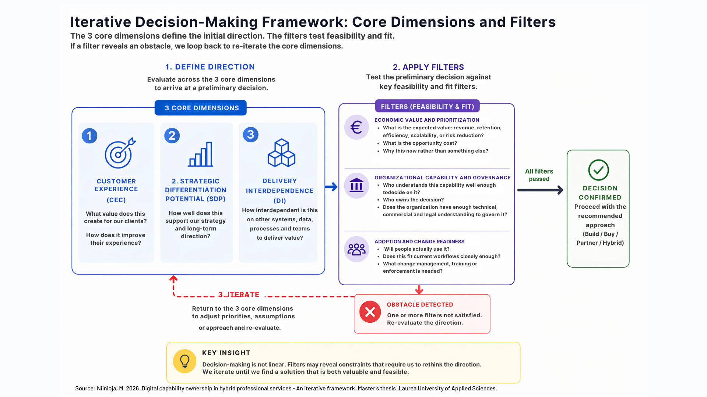

Many organizations are still making digital decisions at the wrong level.

The discussion often begins with:

* “Should we buy this AI tool?”
* “Should we integrate platform X?”
* “Should we automate this process?”
* “Should we build this feature?”

But these are not the first strategic questions organizations should ask.

They are implementation questions.

The more important question comes earlier:

> What organizational capability are we actually trying to create — and why does it matter strategically?

This distinction became central in my MBA thesis on digital capability ownership in hybrid professional services, where executive interviews, operational decision-makers, and customers repeatedly described the same challenge from different perspectives:
organizations frequently start from technology ideas instead of customer-visible capability needs. 

## Business capabilities, digital capabilities, and technology are not the same thing

One of the key theoretical foundations in the study is capability theory.

Business capabilities are not tools or systems.
They are organizational abilities that create value.

Examples (in the legal domain) include:

* regulatory monitoring,
* contract lifecycle management,
* client collaboration,
* proactive legal advisory,
* or risk management.

These capabilities may be digitally enabled, but they are not defined by technology itself.

This distinction is important because many organizations still treat:

* SaaS platforms,
* AI tools,
* portals,
* CRMs,
* or workflow engines
  as if they were capabilities.

They are not.

They are technological enablers.

The thesis findings strongly support the view that value is created through the orchestration of:

* people,
* processes,
* governance,
* data,
* workflows,
* and technology together.

This aligns closely with:

* Resource-Based View (Barney),
* Dynamic Capability Theory (Teece),
* Service-Dominant Logic (Vargo & Lusch),
* and Yoo et al.’s theory of layered digital architecture.

## Digital capabilities are socio-technical and layered

One of the strongest findings from the interviews was that digital capabilities are inherently layered and interdependent.

Customers may experience:

> “a simple portal,”
> “easy collaboration,”
> or “automated monitoring.”

But underneath those experiences exist:

* integrations,
* APIs,
* governance rules,
* expert workflows,
* data models,
* access management,
* operational processes,
* partner coordination,
* and architectural constraints.

The customer sees the visible layer.

The organization must operate the entire capability stack.

Interviewees repeatedly described how apparently small feature requests often triggered much larger architectural, governance, and organizational implications than initially expected.

This reflects Yoo, Henfridsson, and Lyytinen’s concept of digital systems as modular but highly recombinable layered architectures.

Importantly, the study also showed that digital capabilities are not purely technical.
They are socio-technical capabilities.

Technology alone rarely creates operational value.

Value emerges when organizations successfully coordinate:

* workflows,
* adoption,
* governance,
* expertise,
* and customer interaction models around the technology.

## The first decision is strategic. The second is architectural.

One of the most important practical implications of the research is this:

> The decision to pursue a capability is first a business decision and only secondarily an architectural decision.

Architecture remains critically important.
But architecture should not define strategy before organizations understand:

* customer value,
* strategic importance,
* operational impact,
* and organizational feasibility.

Many organizations still begin digital initiatives from tooling:

* “Let’s implement AI.”
* “Let’s buy a platform.”
* “Let’s automate this workflow.”

But interviews in the study showed that customer expectations are usually expressed very differently.

Customers rarely ask directly for:

* APIs,
* AI models,
* integrations,
* or enterprise architecture.

Instead, they describe needs such as:

* responsiveness,
* trust,
* visibility,
* continuity,
* accessibility,
* predictability,
* and reduced operational friction.

The actual challenge for organizations is translating those expectations into feasible digital capabilities.

That translation layer is where many organizations struggle.

## Why technology-first thinking creates waste

The study identified a recurring organizational pattern:

Technology discussions begin before capability implications are understood.

This leads to:

* long business case discussions,
* vendor evaluations,
* integration debates,
* and implementation planning
  before organizations fully understand:
* customer impact,
* strategic relevance,
* organizational adoption requirements,
* governance implications,
* or ecosystem dependencies.

Several interviewees described situations where technologies or integrations were rejected, delayed, or redesigned because the broader operational implications became visible only later in the process.

This is especially common in professional services, where digital capabilities are deeply embedded into:

* expert work,
* customer relationships,
* compliance,
* operational coordination,
* and service delivery models.

As Kohli and Grover argue, IT value is embedded within organizational processes rather than generated independently by technology itself.

## From build-vs-buy to capability orchestration

Traditional build-vs-buy thinking assumes that capabilities can be separated relatively cleanly.

Modern digital capabilities rarely can.

The thesis therefore proposes evaluating capabilities through three core dimensions:

### 1. Customer Experience Criticality (CEC)

How critical is the capability to customer value, trust, continuity, or usability?

### 2. Strategic Differentiation Potential (SDP)

Does the capability create competitive differentiation or support long-term strategic positioning?

### 3. Delivery Interdependence (DI)

How tightly interconnected is the capability with:

* systems,
* data,
* governance,
* workflows,
* partners,
* and organizational coordination?

Together, these dimensions help organizations evaluate:

* which capabilities should remain internal,
* which can be standardized,
* which should be partner-enabled,
* and which may not justify investment at all.

Importantly, the framework is not intended to replace enterprise architecture.

Instead, it complements enterprise architecture by improving earlier-stage strategic capability evaluation:
before organizations prematurely commit to technology-first paths.

## Competitive advantage increasingly comes from orchestration

The research ultimately suggests that competitive advantage no longer comes primarily from owning technology itself.

Most technologies are increasingly accessible.

The differentiator is becoming the organization’s ability to:

* orchestrate capabilities,
* align governance,
* coordinate ecosystems,
* integrate workflows,
* and continuously adapt digital operating models.

Technology enables.

Digital capabilities orchestrate.

Business capabilities create value.

Organizations that continue starting digital transformation from:

> “What tool should we buy?”
> may increasingly struggle to create meaningful strategic advantage.

If you are interested to learn more, or see how the framework could benefit your organization, book a strategy call from the link at the bottom of the footer, or  [connect with me in LinkedIn](https://www.linkedin.com/in/marjukkaniinioja/)

---

# References

Barney, J. (1991). Firm resources and sustained competitive advantage. *Journal of Management*, 17(1), 99–120.

Grant, R. M. (1996). Toward a knowledge‐based theory of the firm. *Strategic Management Journal*, 17(S2), 109–122.

Helfat, C. E., & Peteraf, M. A. (2003). The dynamic resource‐based view: Capability lifecycles. *Strategic Management Journal*, 24(10), 997–1010.

Kohli, R., & Grover, V. (2008). Business value of IT: An essay on expanding research directions to keep up with the times. *Journal of the Association for Information Systems*, 9(1), 23–39.

Offermann, P., et al. (2010). Outline of a business capability management method. *Proceedings of the 16th Americas Conference on Information Systems*.

Ross, J. W., Weill, P., & Robertson, D. C. (2006). *Enterprise Architecture as Strategy: Creating a Foundation for Business Execution*. Harvard Business School Press.

Teece, D. J. (2007). Explicating dynamic capabilities: The nature and microfoundations of sustainable enterprise performance. *Strategic Management Journal*, 28(13), 1319–1350.

Vargo, S. L., & Lusch, R. F. (2004). Evolving to a new dominant logic for marketing. *Journal of Marketing*, 68(1), 1–17.

Williamson, O. E. (1985). *The Economic Institutions of Capitalism*. Free Press.

Yoo, Y., Henfridsson, O., & Lyytinen, K. (2010). The new organizing logic of digital innovation: An agenda for information systems research. *Information Systems Research*, 21(4), 724–735.
